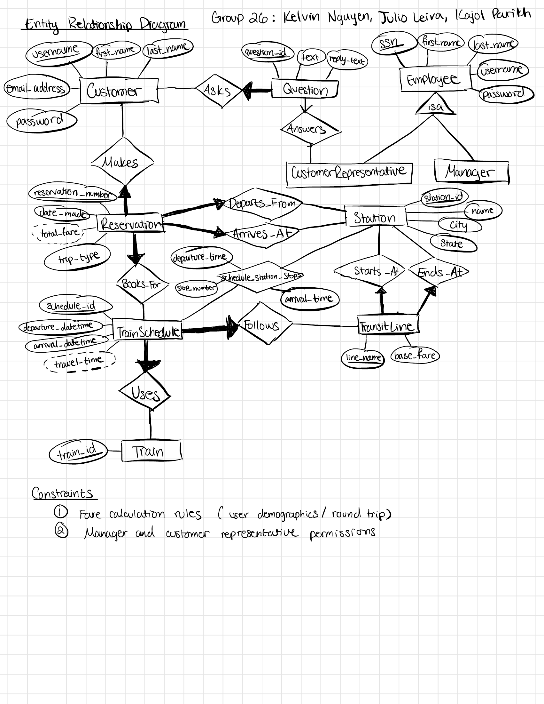

# Railway Reservation & Reporting System

A database-backed railway application built with Java, JSP, JDBC, and MySQL. Customers can search train schedules, calculate fares, book or cancel reservations, and ask support questions. Representatives manage schedules and customer inquiries, while managers use reservation, sales, and revenue reports.

**Scope:** 9 relational tables, 3 user roles, and a browser interface served by Apache Tomcat.

## My contribution

I, Julio Leiva, implemented the complete frontend and backend application, including the Java/JSP pages, JDBC database integration, reservation workflows, and SQL reporting. I collaborated with my teammates on the database schema design.

This was an academic team project. The original design document retains the team attribution.

## Features

| User role | Functionality |
| --- | --- |
| Customer | Account registration and login; schedule searches by origin, destination, and date; sorting by departure, arrival, or fare; stop details; fare calculation with passenger discounts; one-way and round-trip reservations; cancellation; support questions. |
| Customer representative | Schedule and stop edits; stop removal with validation; customer-question replies; schedules by station; customers by transit line and date. |
| Manager | Representative account management; monthly sales; reservation searches; revenue by customer or transit line; highest-spending customer; up to five most-booked transit lines for a selected month. |

## Technologies

- Java 17 and JavaServer Pages (JSP)
- JDBC with MySQL Connector/J
- MySQL with foreign keys, composite keys, unique constraints, and CHECK constraints
- HTML and CSS
- Apache Tomcat and Eclipse

## Database design

The implemented schema contains customers, employees, trains, stations, transit lines, train schedules, schedule station stops, reservations, and support questions. Composite foreign keys ensure that reservation endpoints belong to their selected schedule.

[Original ER diagram and relational schema notes](docs/schema-design.pdf) · [Implemented schema](database/schema.sql)

The PDF preserves the original design notes. The SQL file contains the implemented table definitions.

## Code highlights

- [Database connection configuration](src/main/java/com/cs336/pkg/ApplicationDB.java)
- [Schedule search and fare query](src/main/webapp/customer/search.jsp)
- [Reservation booking](src/main/webapp/customer/reservation.jsp)
- [Reservation cancellation](src/main/webapp/customer/viewReservations.jsp)
- [Monthly sales aggregation](src/main/webapp/manager/salesReport.jsp)
- [Customer and transit-line revenue reports](src/main/webapp/manager/revenueReport.jsp)
- [Schedule updates with commit and rollback](src/main/webapp/representative/editSchedule.jsp)

## Run locally

### Requirements

Use Java 17, Eclipse with Java web development support, a compatible Apache Tomcat runtime, and MySQL 8.0.16 or newer. The exported Eclipse configuration references a Tomcat v8.0 runtime; select the compatible runtime used by your local Eclipse setup when importing. The existing MySQL Connector/J 5.1.49 JAR is included in the application's WEB-INF/lib directory.

### 1. Create the demo database

In MySQL Workbench, open and execute these files in order:

1. `database/schema.sql`
2. `database/demo_data.sql`

The schema creates a separate database named `railway_portfolio_demo`. Import it into a new database; the script intentionally does not drop or overwrite an existing database. The demo data script is intended to run once after schema creation.

The data is entirely fictional and provides train departures for tomorrow and the following day, relative to the import date. Original database accounts and records are not included.

### 2. Import the Eclipse project

Choose **File > Import > General > Existing Projects into Workspace** and select the extracted repository directory. The project name is `RailwayProject`.

Select your Java 17 installation and compatible Tomcat runtime in the project/server configuration. The Eclipse deployment metadata has been aligned with the `RailwayProject` project name.

### 3. Configure the database connection

Set these environment variables in the Tomcat server's launch configuration, then restart the server. In Eclipse, open the server configuration and its launch configuration, then use the **Environment** tab.

| Variable | Value |
| --- | --- |
| `RAILWAY_DB_URL` | `jdbc:mysql://localhost:3306/railway_portfolio_demo` |
| `RAILWAY_DB_USER` | Your local MySQL username |
| `RAILWAY_DB_PASSWORD` | Your local MySQL password |

The URL has the demo-database value as its default. The username and password must be supplied. These are MySQL connection credentials, separate from the application demo accounts below.

### 4. Start the application

Run `RailwayProject` on your configured Tomcat server and open:

`http://localhost:8080/RailwayProject/login.jsp`

Use the port configured for your server if it differs from 8080.

## Demo accounts

All accounts below use the public, fictional password `DemoOnly123!`.

| Role | Username |
| --- | --- |
| Customer | `demo_customer` |
| Additional customer | `demo_traveler` |
| Representative | `demo_rep` |
| Manager | `demo_manager` |

Suggested walkthrough:

1. Sign in as `demo_customer` and search tomorrow's date from **Harbor Central** to **University Park**.
2. View the stops, make a reservation, and find it in the reservation list. Try cancellation on a newly created reservation.
3. Sign in as `demo_manager` to inspect monthly sales, customer/transit-line revenue, and reservation activity.
4. Sign in as `demo_rep` to review support questions and schedule-management pages.

This is a local coursework demonstration. The original authentication logic stores application passwords as plaintext; use only fictional accounts. The application is not deployed by publishing its source code on GitHub.

## Portfolio packaging

The portfolio copy replaces the embedded database login with environment variables, excludes compiled/local artifacts and original database records, and adds fictional demo data and this documentation. The Java connection class was compile-checked. A full Tomcat/MySQL runtime test of this packaged copy has not been performed.
